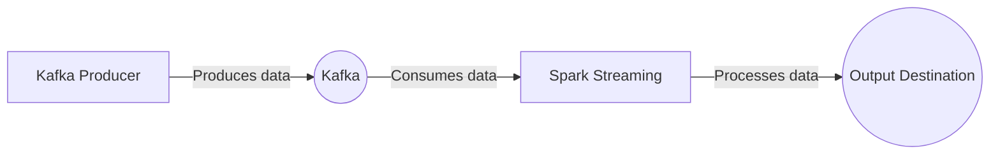

# Spark-Kafka-Data-Pipeline

A data engineering project showcasing a data pipeline built using Apache Kafka and Apache Spark, implemented in Scala.

## Overview

This project demonstrates a real-time data pipeline that ingests streaming data from Apache Kafka and processes it using Apache Spark. The pipeline is built using Scala and leverages the power of Spark Streaming for real-time data processing.

## Architecture

The following diagram illustrates the architecture of the data pipeline:

Click to expand the Mermaid diagram code

## Features
* Ingests streaming data from Apache Kafka.
* Real-time data processing using Apache Spark Streaming.
* Flexible and scalable pipeline architecture.
* Data processing operations like filtering, aggregation, and more.
* Easily customizable for different use cases.

  ## Getting Started
To run this data pipeline locally, follow these steps:

1. Prerequisites:

* Apache Kafka: Install and set up Kafka.
* Apache Spark: Install and set up Spark.

2. Clone the repository: `git clone https://github.com/AnthonyByansi/Spark-Kafka-Data-Pipeline.git
cd Spark-Kafka-Data-Pipeline
`

3. Start the Kafka Producer:

* Update the Kafka producer code (`kafka/Producer.scala`) with your desired data generation logic.
* Follow the instructions in the `kafka/README.md` file to run the Kafka producer.

  
4. Run the Spark Streaming application:

* Update the Spark Streaming application code (`spark/StreamingApp.scala`) as per your data processing requirements.
* Follow the instructions in the `spark/README.md` file to run the Spark Streaming application.
